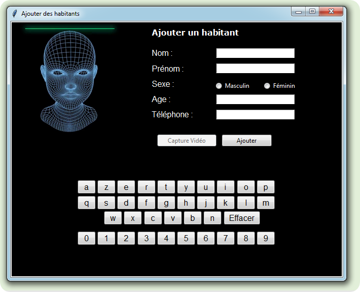

# Video Surveillance System

## Technologies Used

## Project Overview

This project is an intelligent video surveillance system designed to manage building access control through facial recognition and vehicle identification. The system provides a comprehensive graphical interface that allows users to efficiently manage building residents and authorized vehicles that can access the garage.

## Features

### Main Interface
The application features 11 main control buttons providing complete system management:

1. **Camera 1 (Resident Recognition)** - Opens the camera dedicated to resident facial recognition
2. **Camera 2 (Vehicle Recognition)** - Opens the camera dedicated to vehicle recognition
3. **Security Questions** - Fills out a security questionnaire for password recovery
4. **System Email** - Set/change the system's email address
5. **Administrator** - Opens administrator information window for application management
6. **Help & Support** - Opens help window with system usage instructions
7. **Configuration** - Opens configuration window with system parameters
8. **Stop System** - Stops the surveillance system
9. **Start System** - Launches/activates the surveillance system
10. **Registered Residents List** - Displays list of registered residents with building access authorization
11. **Registered Vehicles List** - Displays list of registered vehicles with garage access authorization

### Configuration Window
The configuration window provides administrator-only access to manage system parameters:

- **Resident Management**: Add or remove residents from the system
- **Vehicle Management**: Add or remove authorized vehicles
- **Administrator Management**: Manage administrator access permissions
- **Security Settings**: Change application password
- **Email Configuration**: Update system email address
- **Screenshot Access**: View captured screenshots from the surveillance system

## System Architecture

The system uses a use case diagram approach to connect different functionalities, ensuring seamless integration between resident recognition, vehicle identification, and access control management.

## Installation

[Add installation instructions here]

## Usage

[Add usage instructions here]

## Screenshots
  
  

## Database

The system maintains a database of:
- Registered residents with building access permissions
- Authorized vehicles with garage access permissions
- Administrator accounts and credentials
- Security questions and answers
- System configuration settings

## Security Features

- Password-protected access
- Security question-based password recovery
- Administrator-only configuration access
- Encrypted resident and vehicle data storage
- Screenshot logging for security monitoring

## Contributing

[Add contributing guidelines here]

## License

[Add license information here]

## Contact

[Add contact information here]
